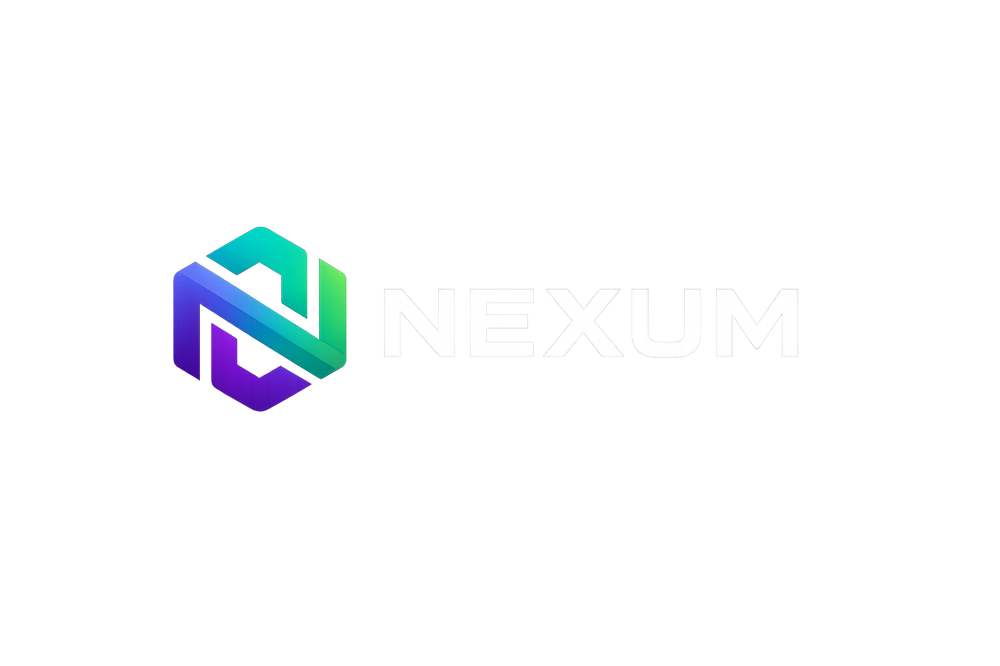

<div align="center">



<br/>

# NEXUM Protocol

### Decentralized Micro-Task Marketplace on Solana

[](LICENSE)
[](https://solana.com)
[]()
[](https://superteam.fun)

**Connect contributors across Southeast Asia with Web3 projects that need real work done —**  
**trustlessly, instantly, on-chain.**

[Website](https://nexum-protocol.netlify.app) · [Docs](docs/) · [Twitter](https://twitter.com/nexum_p)

</div>

---

## The Problem

Over **400 million** working-age adults in Southeast Asia possess marketable digital skills yet most are excluded from the global gig economy due to:

- 💸 **Payment friction** — cross-border payouts take 3–7 days and cost 5–15% in fees
- 🔒 **No portable reputation** — work history locked inside individual platform silos
- 🏦 **Middleman extraction** — Fiverr and Upwork take 20–30% with opaque dispute resolution

Web3 projects face the mirror problem: no trusted, low-friction channel to source and pay reliable contributors for micro-tasks.

---

## The Solution

NEXUM is a **three-layer protocol** built natively on Solana:

```
┌─────────────────────────────────────────────────┐
│              NEXUM PROTOCOL STACK               │
├─────────────────────────────────────────────────┤
│  Layer 3 │  Web Interface (React + Wallet)      │
│  Layer 2 │  On-Chain Reputation (SBT Tokens)    │
│  Layer 1 │  Smart Contract Escrow (Anchor/Rust) │
└─────────────────────────────────────────────────┘
```

| Feature | Description |
|---|---|
| **Task Escrow** | SOL/NXM locked on posting, auto-released on approval |
| **Skill Profiles** | Wallet-linked profiles with skill tags and availability |
| **On-Chain Reputation** | Completed tasks mint non-transferable SBT tokens |
| **NXM Token** | Governance, reputation staking, fee discounts |
| **Dispute Resolution** | NXM staker vote arbitration — transparent, on-chain |

---

## Why Solana

| Need | Solana |
|---|---|
| Sub-cent transaction fees | ~$0.00025 per tx |
| Instant settlement | < 1 second finality |
| Native payment rails | Solana Pay |
| SEA builder community | Superteam SEA |

---

## Repository Structure

```
nexum-protocol/
├── programs/               # Solana smart contracts (Anchor/Rust)
│   └── nexum/src/
│       ├── lib.rs          # Program entrypoint
│       ├── escrow.rs       # Task escrow logic
│       ├── reputation.rs   # SBT reputation system
│       └── token.rs        # NXM token logic
├── app/                    # Frontend (React + Tailwind)
│   └── src/
│       ├── components/     # UI components
│       ├── hooks/          # Solana wallet hooks
│       └── utils/          # Contract interaction helpers
├── sdk/                    # NEXUM SDK (for dApp integrations)
│   └── src/
│       ├── index.ts        # SDK entrypoint
│       ├── tasks.ts        # Task management
│       └── reputation.ts   # Reputation queries
├── docs/                   # Documentation
└── .github/workflows/      # CI/CD pipelines
```

---

## NXM Token — Tokenomics

**Total Supply: 100,000,000 NXM** (fixed, no inflation)

| Allocation | Amount | % | Vesting |
|---|---|---|---|
| Community & Grants | 35,000,000 | 35% | Immediate / Milestone |
| Ecosystem Rewards | 25,000,000 | 25% | 4-year emission curve |
| Core Team | 15,000,000 | 15% | 1yr cliff + 3yr linear |
| Treasury / DAO | 15,000,000 | 15% | DAO governed |
| Early Contributors | 10,000,000 | 10% | 6mo cliff + 2yr linear |

**Utility:** Stake to boost reputation · Governance voting · Fee discounts · Weekly rewards from 2% protocol fee pool

---

## Roadmap

```
Q3 2026 ── Phase 1: Seed
            MVP contracts on devnet · Frontend launch · 50 contributors

Q4 2026 ── Phase 2: Growth
            Mainnet · NXM token live · 500+ contributors · SEA expansion

Q1 2027 ── Phase 3: Scale
            Multi-language · Solana Pay QR · Enterprise tier · Open SDK

Q2 2027 ── Phase 4: DAO
            Full DAO governance · Treasury activation · Series A
```

---

## Getting Started

```bash
# Install Rust
curl --proto '=https' --tlsv1.2 -sSf https://sh.rustup.rs | sh

# Install Solana CLI
sh -c "$(curl -sSfL https://release.solana.com/stable/install)"

# Install Anchor
cargo install --git https://github.com/coral-xyz/anchor avm --locked
avm install latest && avm use latest

# Build contracts
cd programs/nexum && anchor build && anchor test

# Run frontend
cd app && npm install && npm run dev
```

---

## Contributing

NEXUM is open source under MIT. Contributions from the Solana and Superteam SEA community are especially welcome.

1. Fork the repo
2. Create a branch: `git checkout -b feat/your-feature`
3. Commit: `git commit -m 'feat: description'`
4. Open a Pull Request

See [CONTRIBUTING.md](docs/CONTRIBUTING.md) for full guidelines.

---

## Team

| Name | Role |
|---|---|
| **Faiz Suhaimi** | Founder & Protocol Lead — Polybees Network, Malaysia |
| *Open* | Solana Smart Contract Developer |
| *Open* | UI/UX Engineer |

> Hiring from **Superteam SEA** talent pool. Interested? Open an issue or DM [@nexum_p](https://twitter.com/nexum_p).

---

## Links

🌐 [nexumprotocol](https://nexum-protocol.netlify.app) · 🐦 [@nexum_p](https://twitter.com/nexum_p) · 📧 hello@nexumprotocol.xyz

---

<div align="center">
Built with ❤️ in Malaysia for Southeast Asia · Polybees Network © 2026
</div>
